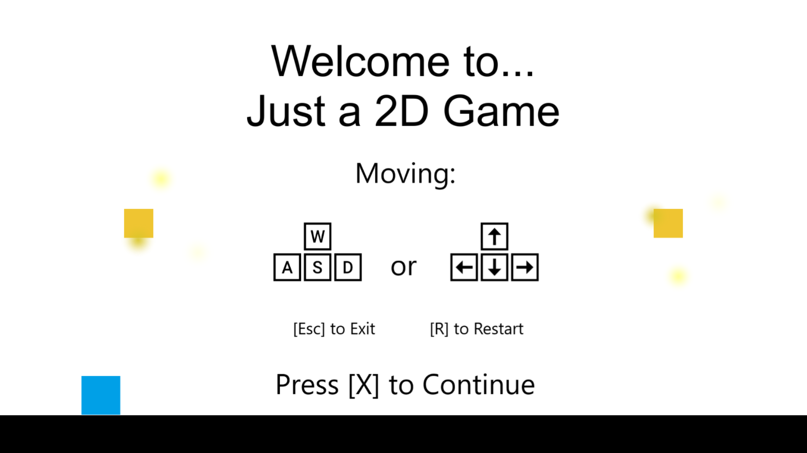
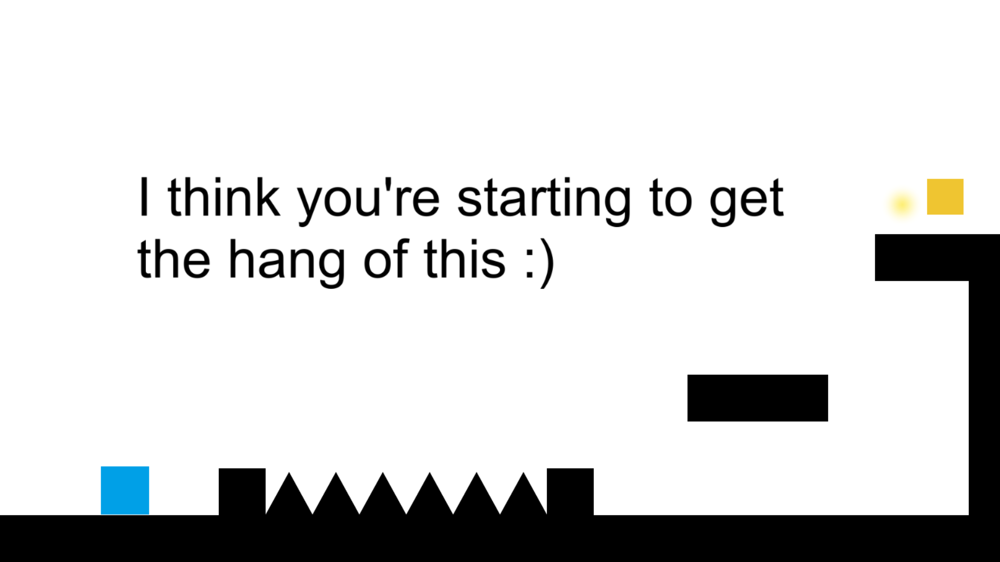
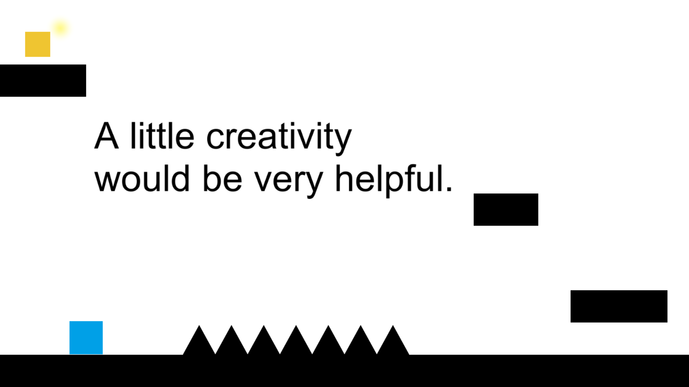

# Just a 2D Game
A short and fun puzzle platformer game. 

  

[Play it Here!](https://yobolo.itch.io/just-a-2d-game)

## :star: Introduction
Just a 2D Game is a short, fun but tricky puzzle platformer game. It is also the first game I've created using the Unity Game Engine.

## :keyboard: Controls

* Use Arrow Keys or WSAD to Move
* Press [x] to start the game 
* Press [r] to restart the level
* Press [Esc] to exit the game (not avaliable on the web version, but it works on the desktop version)

## :bulb: Origins

Growing up, playing video games has alwasy been one of my favourite hobbies. After I started learning how to code, video games were one of the first things that I wanted to create. My first games were simple replicas of old classics like snake, and pong but nothing super original or a game that I could truly call my own. Fast forward to summer of 2018, I decided to give the Unity Engine a try and attempt to build my first original game using Unity. A few weeks later and with a lot of trial and error, "Just a 2D Game" was born. 

Creating "Just a 2D Game" was truly a learning experience on both how to utilize the Unity Engine, and the art of game design itself. From formulating a game plan, to building the first level, then struggling to teleport the player for 2 days, and finally finishing the game, building "Just a 2D Game" was definitely an unforgettable experience. 
